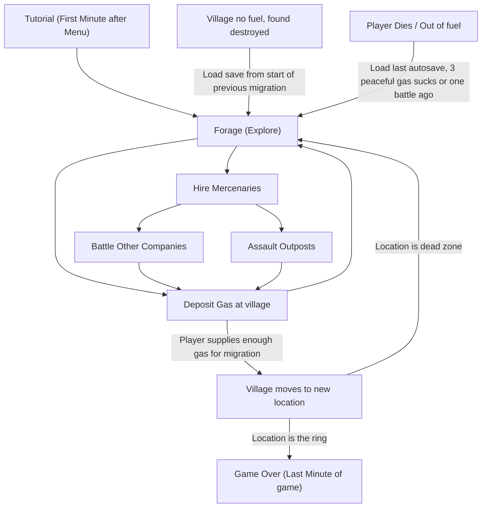

# Dune Riders

## Primal Urges

- Hunting (Destroy enemy convoys)
- Gathering (Find abandoned sites to collect resources from)
- Exploring (Travel procedural road looking for opportunities)
- Building social status (build tribe, pay for new "mercenaries")
- Escape the predator (later trying to escape bandit convoys)
- Social Acceptance (Saving the tribe)

## High Concept

Obtain fuel to support your village's survival and migration to "the ring" (security). With your own an armoured vehicle, explore an open world, find points of interest to gather fuel, precious metal and scrap metals. Hire mercenaries to expand your company. Hunt bandit parties and crime convoys for higher payouts of resources to support your objectives.

## Story

An event caused earth to gradually stop spinning and become tidally locked with the sun. This caused one side to be baking hot and the other side to freeze with only a habitable "ring" around the planet.

The "dead zone" far from the ring became home to bands of scavengers and looters

A tribe of people living in the dead zone far from the ring are encountering infrastructure difficulties due to the environment and now need to evacuate to the ring. They need fuel to survive and get there and it is the players job to save them.

### Characters

Parvati - "Relationship with player" motherly and helpful, takes care of the tribe, needs the player to help save her and the village by obtaining fuel

### Theme

The trials of fatherhood, the responsibility of the man to provide for his tribe

## Gameplay Mechanics

### Victory Conditions

Collect enough gas to support and migrate village to The Ring

### First Minute After Menus

Opening scene of earth from space showing tidally locked planet, female dialogue, "need to get our people to safety" (overall objective), black screen with car revving to signal start of game, short tutorial, off to roaming

### Game Flow

**Drive**
- b -> Accelerate
- a -> break / reverse
- y -> Shoot
- Tap x -> Swap weapon, Hold x -> retract weapon system
- Retracted weapon system allows the player to travel faster
- Weapon types include
  - Short range "gun"
  - Medium range triple burst missiles
  - Long range artillery shell
- Use wheel to steer
- Press wheel to honk
- Should be some separation between the player and the windshield to allow for hand actions
- Players moves around a procedurally generated desert
- "Radio" that allows parvati to talk to you
- In vehicle should be stats on gas, scrap precious metal and their burn rate
- In vehicle should be a map of the surrounding procedural area
- [Later] Patches of mud that allow for skidding
- [Later] Heightened terrain and "jumping" (crushing vehicles)

**Forage**
- Found while exploring in procedurally generated "points of interest"
- Shoot resource to release "suckable resource" (fuel, scrap metal, precious metal)

**Deposit at village**
- Greeted by villager
- Player honks to begin dialogue boxes
- Slider appears to represent amount of gas to provide
- When enough gas has been spent to move tribe it acts as a master save point for when the tribe dies. This is different from when the player dies
- Increased tribe upkeep due to environment and reducing resources should hopefully provide incentive to migrate, bandit companies and outposts become harder and harder
- [Later] Providing extra resources (scrap metal + precious metal) will result in an "investment" (increases in frequency of more powerful "tribally branded" surprise vehicles to convoy)

**Hire Mercenaries**
|Chassis|Specs|Machine Gun|Double Missile|Cannon|
|---|---|---|---|---|
|---|---|Short Range, High Fire Rate, Low Damage|Medium, Medium, Medium|Long Range, Slow Fire Rate, High Damage|
|Buggy|Fast, East to Destroy, Low Gas|X|X|-|
|Light Rider|Normal, Normal, Normal|X|X|X|
|Armoured Rider|Slow, Hard to Destroy, High Gas|-|X|X|

- Found while exploring in procedurally generated "points of interest"
- Mercenary's armoured cars are generated in a random configuration
  - [Later] Ram: Heavy (gas intensive)?, Medium, Light
- Approaching mercenaries displays prompt showing precious metal cost and car stats
  - Honk to start dialogue
  - Thumbs up to hire
  - Thumbs down to decline

**Battle Other Companies**
- Randomly generated groups crossing the player
- Player needs to be able to have access to
  - Attack command
  - Follow command
  - Wait here command
- Player can choose to engage based on what they can see
- Cars attack once the player gets too close or shoots at the convoy
- Cars have battle AI that allows them a primitive sense of strategy and aiming
  - Weakened cars attempt to create distance from the battle
  - AI depends on car configuration
- Cars upon being destroyed release "suckable" resources
- Cars can be rammed and damaged
- Cars can be shot and damaged
- Cars chassis need to be destroyed to "die"
  - Gun can be damaged -> stops shooting
  - Wheels can be damaged -> stops moving
  - Armour can be damaged -> weakens by expose the chassis

**Assault Outposts**
- Procedurally generated throughout desert
- Can have a 4 or 8 turret configuration
  - Turrets "lob" shots with longer delays to dodge the farther you are
- Upon destruction drops massive resources
- Calls in a huge defensive raid, puts player under time pressure to destroy turrets to stop friendly cars dying
- Turrets drop precious metals, drops nothing if main structure is targeted only
- Turrets / Outpost health respawn after failed raid

### Resource Types

- Gas - Fuel to continue driving, [later] Can sell for upgrades
- Precious Metal - Purchase new mercenaries
- Scrap Metal - Repairs + [Later] Upgrades

### Last Minute

When gas is provided for the last migration to the ring the camera fades black and reappears in the city ring with all the villagers cheering the player and a girl running up to stand alongside smiling, a score count is shown in front of the player, this score then fades to "Created by Tristan Mastrodicasa" and other credits. To exit the player can put their hand next to them indicating leaving with the person who ran up to them.

---

## Project

### Risks

- Having the gun follow your head is intuitive during battles
- Battles are fun
- The honk and thumbs up thumbs down strategy is helpful
- Quest 2 hardware can handle a procedural environment with a battle between 10 v 10 vehicle entities
- How to recover from massive loss? (Maybe massive loss is not possible? Abundance of mercs bound only by gas limitations?, auto retreat, load last save?)

### Marketing

- Instagram marketing can co inside with start of Only Us marketing
- Testing methodologies can be released in blog posts and on reddit to passively market game 